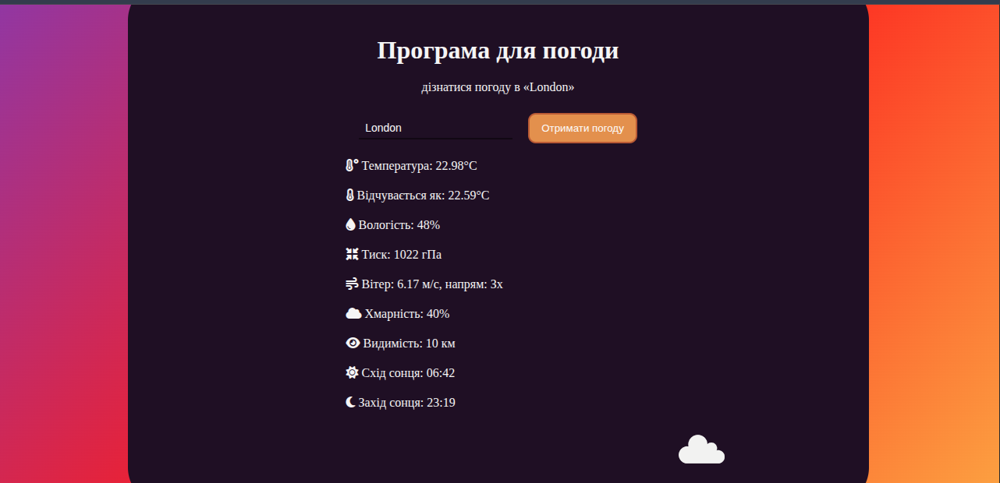

# Weather API Vue Project

Простий навчальний додаток на Vue.js для отримання та відображення погодних даних через Weather API. Проєкт створений для ознайомлення з Vue 3, компонентами, формами, валідацією та роботою з API.

---

## 🔧 Технології

- Vue.js 3
- JavaScript (ES6+)
- HTML5, CSS3
- [core-js](https://github.com/zloirock/core-js)
- [ESLint](https://eslint.org/)

---

## 🚀 Швидкий старт

### 1. Клонування репозиторію

```bash
git clone https://github.com/your-username/weather-api-vue.git
cd weather-api-vue
```

### 2. Встановлення залежностей

```bash
npm install
```

### 3. Запуск у режимі розробки

```bash
npm run serve
```

### 4. Збірка для продакшну

```bash
npm run build
```

### 5. Лінтинг та автофікс

```bash
npm run lint
```

---

## 🖼️ Інтерфейс
  
> 

---

## 🗂️ Структура проєкту

```
weather-api-vue/
│
├── src/
│   ├── App.vue
│   ├── main.js
│   └── assets/
├── public/
│   └── index.html
├── package.json
├── babel.config.js
├── jsconfig.json
├── vue.config.js
└── README.md
```

---

## 📦 API

### `GET /geo/1.0/direct?q=${this.city}&limit=5&appid=${apiKey}`

Отримати координати міста за його назвою.

**Параметри:**

- `q` — назва міста (наприклад, Kyiv)

**Приклад відповіді:**

```json
data {
  [
    {
        "name": "Kyiv",
        "local_names": {
            "bn": "কিয়েভ",
            "ml": "കീവ്",
            "sw": "Kiev",
            "ascii": "Kyiv",
            "es": "Kiev",
            "sq": "Kievi",
            "ku": "Kîev",
            "eo": "Kijivo",
            "wo": "Kiyew",
            "bo": "ཀིབ།",
            "mi": "Kieu",
            "pt": "Kiev",
            "am": "ኪየቭ",
            "fi": "Kiova",
            "vo": "Küyiv",
            "ht": "Kyèv",
            "en": "Kyiv",
            "gl": "Kiev",
            "et": "Kõjiv",
            "ia": "Kiev",
            "zu": "IKiyevi",
            "pl": "Kijów",
            "fa": "کی‌یف",
            "my": "ကီးယက်မြို့",
            "gv": "Kyiv",
            "cs": "Kyjev",
            "fy": "Kiev",
            "sc": "Kiev",
            "sk": "Kyjev",
            "io": "Kyiv",
            "eu": "Kiev",
            "bs": "Kijev",
            "feature_name": "Kyiv",
            "ja": "キーウ",
            "oc": "Kyiiv",
            "pa": "ਕੀਵ",
            "gd": "Kyiv",
            "be": "Кіеў",
            "de": "Kiew",
            "mr": "क्यीव",
            "no": "Kyiv",
            "kn": "ಕೀವ್",
            "da": "Kyiv",
            "fr": "Kiev",
            "bi": "Kyiv",
            "fo": "Kyiv",
            "hu": "Kijev",
            "mk": "Кијив",
            "hr": "Kijiv",
            "sv": "Kyiv",
            "hi": "कीव",
            "tg": "Киев",
            "lv": "Kijiva",
            "nn": "Kiev",
            "cv": "Кийӳ",
            "az": "Kiyev",
            "nl": "Kiev",
            "he": "קייב",
            "ko": "키이우",
            "tt": "Киев",
            "tr": "Kıyiv",
            "af": "Kyiv",
            "is": "Kænugarður",
            "sr": "Кијев",
            "tl": "Kiev",
            "kk": "Киев",
            "jv": "Kyiv",
            "vi": "Kyiv",
            "uz": "Kiyev",
            "mt": "Kjiv",
            "se": "Kiova",
            "el": "Κίεβο",
            "ca": "Kíiv",
            "ab": "Кыив",
            "ba": "Киев",
            "mn": "Киев",
            "hy": "Կիև",
            "ln": "Kyjiw",
            "ky": "Киев",
            "th": "เคียฟ",
            "ta": "கீவ்",
            "ru": "Киев",
            "os": "Киев",
            "id": "Kyiv",
            "sl": "Kijev",
            "ga": "Cív",
            "br": "Kyiv",
            "lb": "Kiew",
            "sh": "Kyiv",
            "an": "Kyiv",
            "ar": "كييف",
            "tw": "Kiev",
            "yo": "Kiev",
            "ie": "Kyiv",
            "it": "Kiev",
            "ro": "Kiev",
            "ka": "კიევი",
            "cy": "Kyiv",
            "yi": "קיעוו",
            "zh": "基辅",
            "la": "Kiovia",
            "bg": "Киев",
            "ur": "کیف",
            "kv": "Киев",
            "te": "క్యివ్",
            "ms": "Kiev",
            "ug": "كىيېۋ",
            "lt": "Kijevas",
            "kl": "Kyiv",
            "cu": "Кꙑѥвъ",
            "qu": "Kiyiw",
            "uk": "Київ"
        },
        "lat": 50.4500336,
        "lon": 30.5241361,
        "country": "UA"
    },
    {
        "name": "Kyiv",
        "local_names": {
            "en": "Kyiv",
            "uk": "Київ",
            "de": "Kyjiw",
            "ru": "Киев"
        },
        "lat": 47.8671228,
        "lon": 31.0179572,
        "country": "UA",
        "state": "Mykolaiv Oblast"
    }
]
}
```

---

### `GET /data/2.5/weather?lat=${this.lat}&lon=${this.lon}&appid=${apiKey}`

Отримати дані про погоду за координатами міста.

**Параметри:**

- `lat` — широта
- `lon` — довгота

**Приклад відповіді:**

```json
{
    "data": {
        "coord": {
            "lon": 30.5241,
            "lat": 50.45
        },
        "weather": [
            {
                "id": 804,
                "main": "Clouds",
                "description": "overcast clouds",
                "icon": "04n"
            }
        ],
        "base": "stations",
        "main": {
            "temp": 14.08,
            "feels_like": 14,
            "temp_min": 14.08,
            "temp_max": 14.08,
            "pressure": 1011,
            "humidity": 94,
            "sea_level": 1011,
            "grnd_level": 996
        },
        "visibility": 10000,
        "wind": {
            "speed": 0.45,
            "deg": 333,
            "gust": 0.89
        },
        "clouds": {
            "all": 95
        },
        "dt": 1749691503,
        "sys": {
            "type": 2,
            "id": 2003742,
            "country": "UA",
            "sunrise": 1749692783,
            "sunset": 1749751759
        },
        "timezone": 10800,
        "id": 696050,
        "name": "Pushcha-Vodytsya",
        "cod": 200
    },
    "status": 200,
    "statusText": "OK",
    "headers": {
        "content-length": "525",
        "content-type": "application/json; charset=utf-8"
    },
    "config": {
        "transitional": {
            "silentJSONParsing": true,
            "forcedJSONParsing": true,
            "clarifyTimeoutError": false
        },
        "adapter": [
            "xhr",
            "http",
            "fetch"
        ],
        "transformRequest": [
            null
        ],
        "transformResponse": [
            null
        ],
        "timeout": 0,
        "xsrfCookieName": "XSRF-TOKEN",
        "xsrfHeaderName": "X-XSRF-TOKEN",
        "maxContentLength": -1,
        "maxBodyLength": -1,
        "env": {},
        "headers": {
            "Accept": "application/json, text/plain, */*"
        },
        "method": "get",
        "url": "https://api.openweathermap.org/data/2.5/weather?lat=50.4500336&lon=30.5241361&units=metric&appid=ea95d7be6facb880f812da37738353fc",
        "allowAbsoluteUrls": true
    },
    "request": {}
}
```

---

## 📄 Ліцензія

Цей проєкт має ліцензію GNU GENERAL PUBLIC LICENSE — дивись [LICENSE](./LICENSE).

---


_Цей проєкт створений для навчальних цілей._